信息收集

### 资产收集
给我们的是一个公司或者组织的名字，让我们以这个公司为目标做红蓝对抗。
#### fofa/shodan/zoomeye的使用

##### https://fofa.so/

FOFA 搜索引擎检索到的内容主要是服务器，数据库，某个网站管理后台，路由器，交换机，公共ip的打印机，网络摄像头，门禁系统，Web服务等等。 这类搜索引擎又有另一个名字：网络空间测绘系统。


例如Apache出来了一个高危漏洞，受影响的版本号为2.4.23,我们需要去本公司可能受此漏洞影响的Apache服务器，那么我们可以使用高级查询语句server==”Apache/2.4.23”&&domain=”xxx.com”，搜索结果即为本公司域名下的所有子域名可能存在Apache2.4.23版本漏洞的URL，安全人员可以对结果进行检查，及时修复漏洞。（详细语法可在网页搜索框下方点击“查询语法”）


特点

1.支持API查询接口，便于进行程序间的自动化查询、处理功能，进行进一步的业务分析。

​	用法：所有调用都需要提供身份信息，主要是email和key，email主要是注册和登陆时填写的email，key需要用户到个人中心获取32位的hash值，即为API KEY。将上面的两个信息填入api接口中，即可获取json格式的数据。

2.支持下载功能

​	用法：搜索到结果之后可在右侧选择下载功能，可下载搜索到的所有数据，下载的格式支持CSV，JSON，XML格式，方便程序调用进行全网扫描。

注意

1) 普通会员和高级会员的 免费100条 和 免费10000条 是指每天调用API可以免费获取前100条和前10000条,假设高级会员调用API,每页获取3333条，第1、2、3页由于没有超过前10000条，所以免费，第4页超过前10000条，所以会扣除1FOFA币。
2) 直接下载数据，无论多少条数据，都要花费FOFA币。
   普通会员300 高级会员1000 终身制 。

##### https://www.shodan.io/

**Shodan是用于搜索连接到互联网的设备的工具。**

与搜索引擎可以帮助你找到网站不同，Shodan可以帮助你找到有关台式机,服务器，loT设备等的信息。此信息包括元数据，例如在每个设备上运行的软件。
Shodan的常见用途包括网络安全，市场研究，网络风险，扫描loT设备和跟踪勒索软件。

连接shodan的方法有很多，比如网站、官方的python命令行界面工具和库，各种语言的社区驱动库以及官方的REST API与Shodan，此处主要介绍网站。


它的工作方式类似于CLI工具的搜索命令，但带有精美的WebUI来显示结果。它显示每个主机的摘要，与查询匹配的主机总数(如CLI的count命令）和一些统计信息(如stats命令)。

选择主机后，可以看到快照规范表，漏洞影响主机，开放端口和开放端口标识信息（如下）。


##### https://www.zoomeye.org/（推荐）

**ZoomEye是一款针对网络空间的搜索引擎，收录了互联网空间中的设备、网站及其使用的服务或组件等信息。**

**ZoomEye** 拥有两大探测引擎：**Xmap** 和 **Wmap**，分别针对网络空间中的设备及网站，通过 24 小时不间断的探测、识别，标识出互联网设备及网站所使用的服务及组件。研究人员可以通过 ZoomEye 方便的了解组件的普及率及漏洞的危害范围等信息。

虽然被称为 “黑客友好” 的搜索引擎，但ZoomEye 并不会主动对网络设备、网站发起攻击，收录的数据也仅用于安全研究。ZoomEye更像是互联网空间的一张航海图。ZoomEye兼具信息收集的功能与漏洞信息库的资源，对于广大的渗透测试爱好者来说以一件非常不错的利器。


zoomeye所收集的信息比较全，不仅提供网站ip，端口使用设备，地区分布等等，甚至还会给出各大组件、服务器系统等存在的历史性漏洞的描述文档，如果使用漏洞的描述性文档中所给出的指示性内容，那么就可以找寻目标进行攻击了！

##### 使用手册

针对不同的信息需要，搜索时会有对应的查询语句

fofa：网站自带查询语句（搜索框下方）

shodan：https://www.jianshu.com/p/0c184915c118

zoomeye:https://blog.csdn.net/ncafei/article/details/63683377

### 搜索引擎

##### google hack

google hack是指使用[Google](https://baike.baidu.com/item/Google)等搜索引擎对某些特定的网络主机漏洞（通常是服务器上的脚本漏洞）进行搜索，以达到快速找到漏洞主机或特定主机的漏洞的目的。

###### 介绍

Google毫无疑问是当 今世界上最强大的搜索引擎。然而，在黑客手中，它也是一个秘密武器，它能搜索到一些你意想不到的信息。赛迪编者把 他们进行了简单的总结不是希望您利用他去攻击别人的网站，而是利用这些技巧去在浩如烟海的网络信息中，来个大海捞针，寻找到对您有用的信息。

在SEO优化中,通常使用这种技术达到入侵一些网站挂外链之用。[黑帽SEO](https://baike.baidu.com/item/黑帽SEO/6111825)手法用来做[google优化](https://baike.baidu.com/item/google优化/8285781)推广和百度优化推广，应用得当，效果是十分明显的。 SEO俗语：不管白猫黑猫，抓到耗子就是好猫。

###### 基本命令

##### googlehack 常用语法

site    指定域名


intext  正文中存在关键字的网页


intitle  标题中存在关键字的网页


info    一些基本信息


inurl   URL存在关键字的网页


filetype 搜索指定文件类型

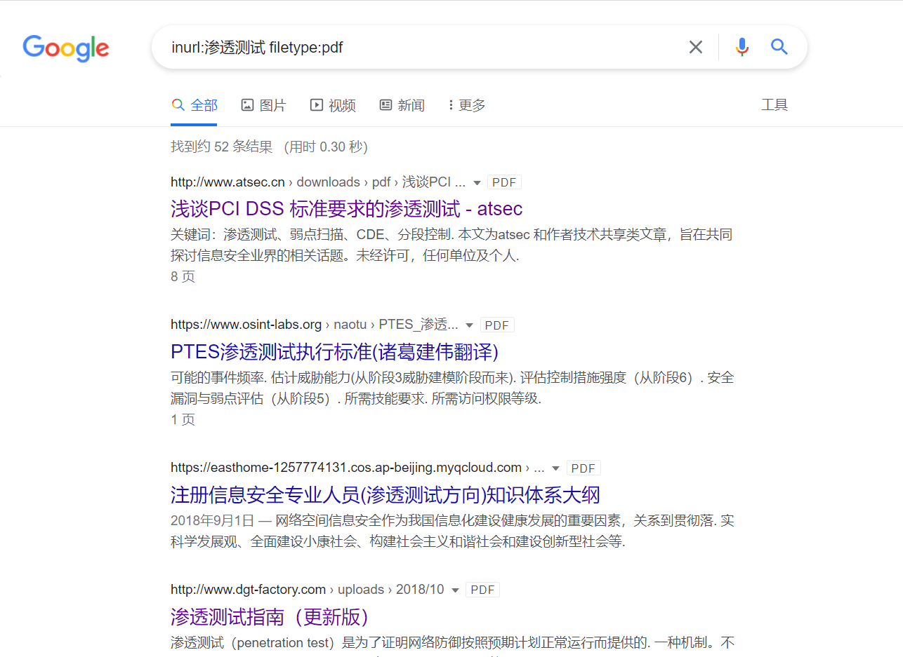


site:xx.com 返回所有与该站有关的url


link:xx.com 返回所有与该站做了链接的站


site:xx.com filetype:txt 查找TXT文件 

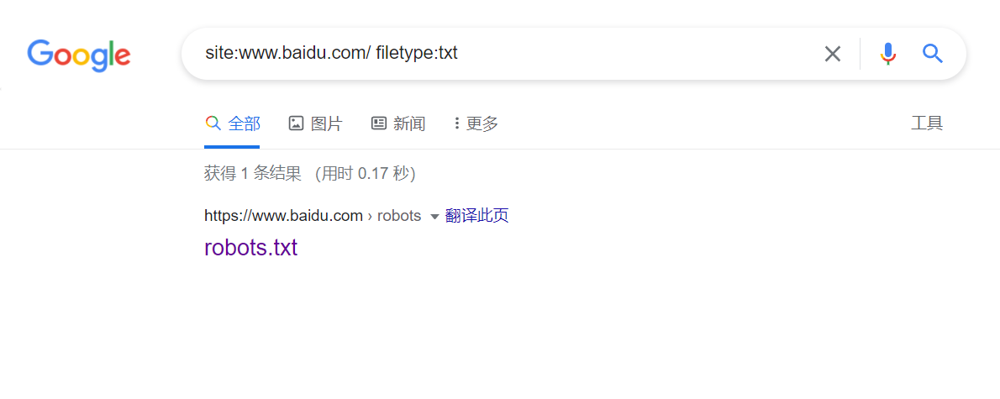

其他的以此类推自由组合

查找后台

site:xx.com intext:管理

site:xx.com inurl:login

site:xx.com intitle:后台

查看服务器使用的程序

site:xx.com filetype:asp

site:xx.com filetype:php

site:xx.com filetype:jsp

site:xx.com filetype:aspx

查看上传漏洞

site:xx.com inurl:file

site:xx.com inurl:load

查找注射点

site:xx.com filetype:asp


##### github常用搜索语法

tips：

 有关可以添加到任何搜索限定符以进一步改善结果的搜索语法列表，请参阅“[了解搜索语法](https://links.jianshu.com/go?to=https%3A%2F%2Fdocs.github.com%2Fcn%2Ffree-pro-team%40latest%2Farticles%2Funderstanding-the-search-syntax)”。

对多个字词的搜索词使用引号。 例如，如果要搜索具有标签 "In progress" 的议题，可搜索 `label:"in progress"`。 搜索不区分大小写。

###### 按仓库名称、说明或自述文件内容搜索

通过 `in` 限定符，您可以将搜索限制为仓库名称、仓库说明、自述文件内容或这些的任意组合。 如果省略此限定符，则只搜索仓库名称和说明。

| 限定符            | 示例                                                         |
| ----------------- | ------------------------------------------------------------ |
| `in:name`         | **jquery in:name** matches repositories with "jquery" in the repository name. |
| `in:description`  | **jquery in:name,description** matches repositories with "jquery" in the repository name or description. |
| `in:readme`       | **jquery in:readme**  matches repositories mentioning "jquery" in the repository's README file. |
| `repo:owner/name` | **repo:octocat/hello-world** 匹配特定仓库名称。              |


###### 基于仓库的内容搜索

除了使用 `in:readme` 以外，无法通过搜索仓库内的特定内容来查找仓库。 要搜索仓库内的特定文件或内容，您可以使用查找器或代码特定的搜索限定符。

| 限定符      | 示例                                                         |
| ----------- | ------------------------------------------------------------ |
| `in:readme` | **octocat in:readme** matches repositories mentioning "octocat" in the repository's README file. |


###### 在用户或组织的仓库内搜索


要在特定用户或组织拥有的所有仓库中搜索，您可以使用 `user` 或 `org` 限定符。

| 限定符            | 示例                                                         |
| ----------------- | ------------------------------------------------------------ |
| `user:*USERNAME*` | **user:defunkt forks:>100** 匹配来自 @defunkt、拥有超过 100 复刻的仓库。 |
| `org:*ORGNAME*`   | **org:github** 匹配来自 GitHub 的仓库。                      |


①按仓库大小搜索

The `size` qualifier finds repositories that match a certain size (in kilobytes), using greater than, less than, and range qualifiers 

“size”限定符使用“大于”、“小于”和“范围”限定符查找匹配特定大小(以千字节为单位)的存储库

| 限定符     | 示例                                                   |
| ---------- | ------------------------------------------------------ |
| `size:*n*` | **size:1000** 匹配恰好为 1 MB 的仓库。                 |
|            | **size:>=30000** 匹配至少为 30 MB 的仓库。             |
|            | **size:<50** 匹配小于 50 KB 的仓库。                   |
|            | **size:50..120** 匹配介于 50 KB 与 120 KB 之间的仓库。 |


②按关注者数量搜索

| 限定符          | 示例                                                         |
| --------------- | ------------------------------------------------------------ |
| `followers:*n*` | **node followers:>=10000** 匹配有 10,000 或更多关注者提及文字 "node" 的仓库。 |
|                 | **styleguide linter followers:1..10** 匹配拥有 1 到 10 个关注者并且提及 "styleguide linter" 一词的的仓库。 |


③按复刻数量搜索

| 限定符      | 示例                                              |
| ----------- | ------------------------------------------------- |
| `forks:*n*` | **forks:5** 匹配具有至少 205 个复刻的仓库。       |
|             | **forks:<90** 匹配具有少于 90 个复刻的仓库。      |
|             | **forks:10..20** 匹配具有 10 到 20 个复刻的仓库。 |


④按星号数量搜索

| 限定符      | 示例                                                         |
| ----------- | ------------------------------------------------------------ |
| `stars:*n*` | **stars:500** 匹配恰好具有 500 个星号的仓库。                |
|             | **stars:10..20** 匹配具有 10 到 20 个星号、小于 1000 KB 的仓库。 |
|             | **stars:>=500 fork:true language:php** 匹配具有至少 500 个星号，包括复刻的星号（以 PHP 编写）的仓库。 |


⑤按仓库创建或上次更新时间搜索

您可以基于创建时间或上次更新时间过滤仓库。 对于仓库创建，您可以使用 `created` 限定符；要了解仓库上次更新的时间，您要使用 `pushed` 限定符。 `pushed` 限定符将返回仓库列表，按仓库中任意分支上最近进行的提交排序。

两者均采用日期作为参数。 日期格式必须遵循 [ISO8601](https://links.jianshu.com/go?to=http%3A%2F%2Fen.wikipedia.org%2Fwiki%2FISO_8601)标准，即 `YYYY-MM-DD`（年-月-日）。 您也可以在日期后添加可选的时间信息 `THH:MM:SS+00:00`，以便按小时、分钟和秒进行搜索。 这是 `T`，随后是 `HH:MM:SS`（时-分-秒）和 UTC 偏移 (`+00:00`)。

| 限定符                 | 示例                                                         |
| ---------------------- | ------------------------------------------------------------ |
| `created:*YYYY-MM-DD*` | **webos created:<2011-01-01** 匹配具有 "webos" 字样、在 2011 年之前创建的仓库。 |
| `pushed:*YYYY-MM-DD*`  | **css pushed:>2013-02-01** 匹配具有 "css" 字样、在 2013 年 1 月之后收到推送的仓库。 |
|                        | **case pushed:>=2013-03-06 fork:only** 匹配具有 "case" 字样、在 2013 年 3 月 6 日或之后收到推送并且作为复刻的仓库。 |

⑥按语言搜索

| 限定符                | 示例                                                         |
| --------------------- | ------------------------------------------------------------ |
| `language:*LANGUAGE*` | **rails language:javascript** 匹配具有 "rails" 字样、以 JavaScript 编写的仓库。 |

⑦按主题搜索

| 限定符          | 示例                                                |
| --------------- | --------------------------------------------------- |
| `topic:*TOPIC*` | **topic:jekyll** 匹配已归类为 "jekyll" 主题的仓库。 |

⑧按主题数量搜索

| 限定符       | 示例                                   |
| ------------ | -------------------------------------- |
| `topics:*n*` | **topics:5** 匹配具有五个主题的仓库。  |
|              | **topics:>3** 匹配超过三个主题的仓库。 |

⑨按许可搜索

| 限定符                      | 示例                                                         |
| --------------------------- | ------------------------------------------------------------ |
| `license:*LICENSE_KEYWORD*` | **license:apache-2.0** 匹配根据 Apache License 2.0 授权的仓库。 |

###### 基于仓库是否为镜像搜索

| 限定符         | 示例                                                         |
| -------------- | ------------------------------------------------------------ |
| `mirror:true`  | **mirror:true GNOME**  matches repositories that are mirrors and contain the word "GNOME." |
| `mirror:false` | **mirror:false GNOME**  matches repositories that are not mirrors and contain the word "GNOME." |


###### 基于仓库是否已存档搜索

| 限定符           | 示例                                                         |
| ---------------- | ------------------------------------------------------------ |
| `archived:true`  | **archived:true GNOME**  matches repositories that are archived and contain the word "GNOME." |
| `archived:false` | **archived:false GNOME** matches repositories that are not archived and contain the word "GNOME." |


###### 基于具有 `good first issue` 或 `help wanted` 标签的议题数量搜索

您可以使用限定符 `help-wanted-issues:>n` 和 `good-first-issues:>n` 搜索具有最少数量标签为 `help-wanted` 或 `good-first-issue` 议题的仓库。。

| 限定符                  | 示例                                                         |
| ----------------------- | ------------------------------------------------------------ |
| `good-first-issues:>n`  | **good-first-issues:>2 javascript**  匹配具有超过两个标签为 `good-first-issue` 的议题且包含 "javascript" 字样的仓库。 |
| `help-wanted-issues:>n` | **help-wanted-issues:>4 react**  匹配具有超过四个标签为 `help-wanted` 的议题且包含 "React" 字样的仓库。 |


### 域名/ip/网站信息

#### 域名

由于IP地址具有不方便记忆并且不能显示地址组织的名称和性质等缺点，人们设计出了域名，并通过网域名称系统（DNS，Domain Name System）来将域名和IP地址相互映射，使人更方便地访问互联网，而不用去记住能够被机器直接读取的IP地址数串。

比如www.baidu.com，这就是一个域名，简单来说就是ip不好记，所以有了域名来方便记忆。

#### 子域名

子域名有二级域名及多级域名。

例如www.dns0755.net是dns0755.net的子域名，而dns0755.net又是net的子域名。国际顶级域名的子域名叫做二级域名。   
如A.com是一级域名，A.B.com则是二级域名。一级域名较二级域名级别更高，而二级域名则是依附于一级域名下的附属分区域名，即二级域名是一级域名的细分层级。    
通过网址上【.】数量来判断域名层级，有多少【.】就为几级域名，如A.com是一级域名，A.B.com则是二级域名。    
如：baidu.com 是百度的顶级域名，zhidao.baidu.com 是二级域名，zhidao.zhidao.baidu.com 是三（多）级域名，*.baidu.com 是泛域名。

**进行渗透测试时，其主域名找不到漏洞时，就可以尝试去测试收集到的子域名，有可能测试子域名网站时会有意向不到的效果，然后可以由此横向到主网站。**

#### 域名查询

##### whois查询

在whois查询中，获取注册人姓名和邮箱、电话信息，可以通过搜索引擎，社交网络，进一步挖掘出更多域名所有人的信息
DNS服务器

域名注册邮箱，可用于社工或是登录处的账号

http://whois.chinaz.com

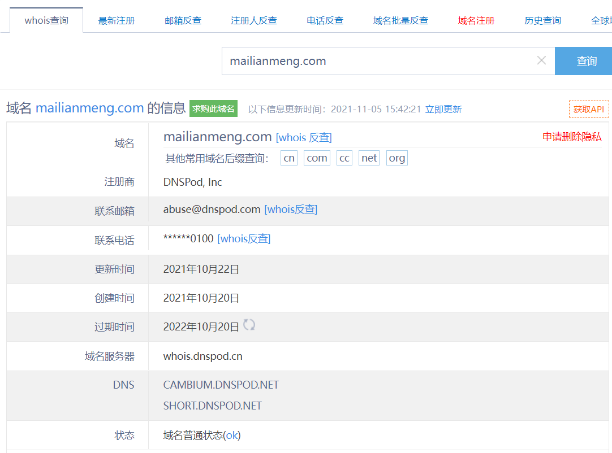

https://whois.aliyun.com


##### 子域名查询

**①gobuster进行查询**
gobuster dns -d 域名 -w /usr/share/seclists/Discovery/DNS/subdomains-top1million-110000.txt -i -t 30 -r 114.114.114.114
dns 指定使用DNS探测模式
-d 指定主域名
-w 指定字典文件
-i 显示域名对应的IP地址
-t 指定线程数
-r 指定DNS服务器

**②在线工具进行扫描**

DNS查询：https://dnsdb.io/zh-cn/
微步在线：https://x.threatbook.cn/
在线域名信息查询：http://toolbar.netcraft.com/site_report?url=
DNS、IP等查询：http://viewdns.info/
CDN查询IP：https://tools.ipip.net/cdn.php
SecurityTrails平台： https://securitytrails.com/domain/www.baidu.com/history/a
在线子域名二级域名查询：http://tools.bugscaner.com/subdomain/

#### IP-CDN绕过技术

##### 什么是CDN？

CDN的全称是Content Delivery Network，即内容分发网络。

CDN是构建在现有网络基础之上的智能虚拟网络，依靠部署在各地的边缘服务器，通过中心平台的负载均衡、内容分发、调度等模块，使用户就近获取所需内容，降低网络拥塞，提高用户访问响应速度和命中率。但在安全测试过程中，若存在CDN服务，将会影响到后续的安全测试过程

##### 如何判断目标存在CDN？

利用多节点技术进行请求返回判断

1. 超级ping网址：http://ping.chinaz.com/https://ping.aizhan.com/

   无CDN情况：
   通过检测，发现返回的IP都一样，所以这是没有CDN

   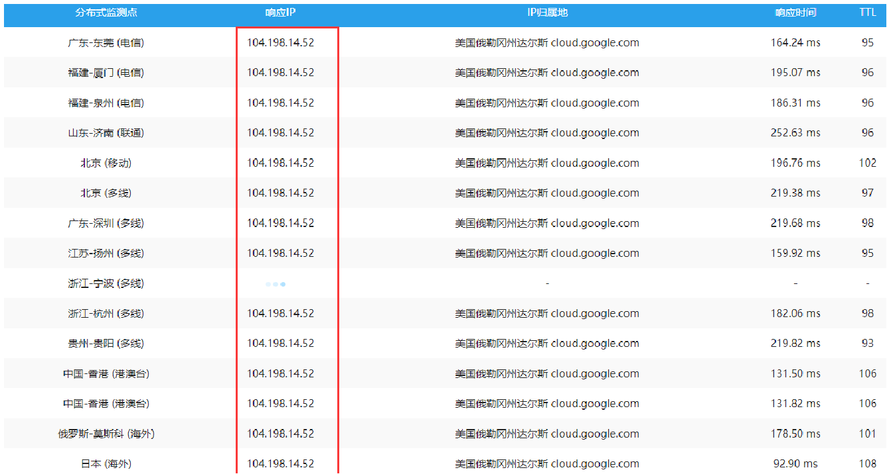

   有CDN情况：
   通过检测，发现有多个IP返回，说明存在CDN

   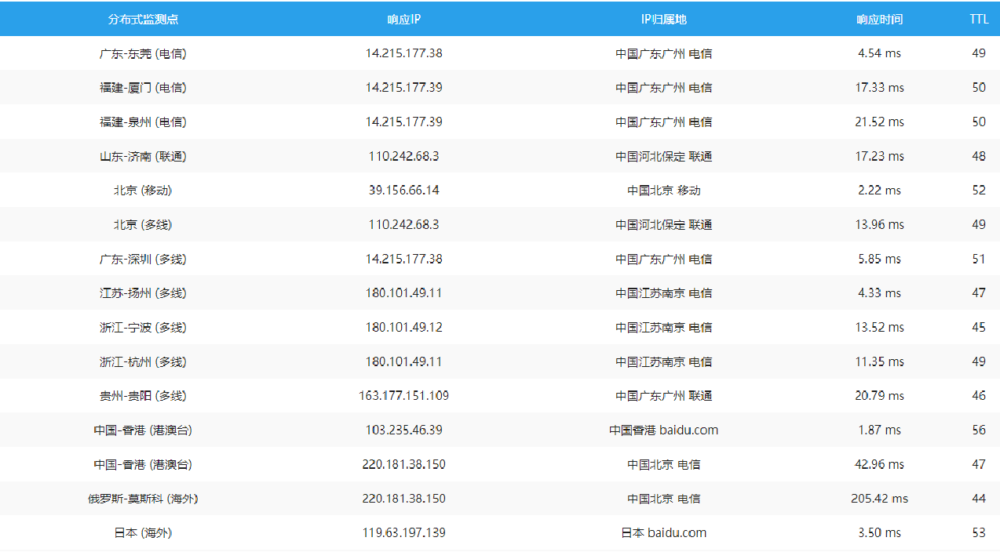

2. Windows命令查询：nslookup，若目标存在多个IP的话，就很有可能有CDN服务

   无CDN情况：

   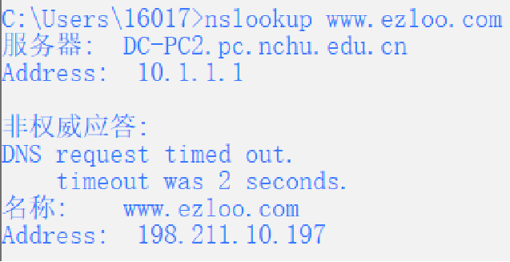

   有CDN情况：
   
   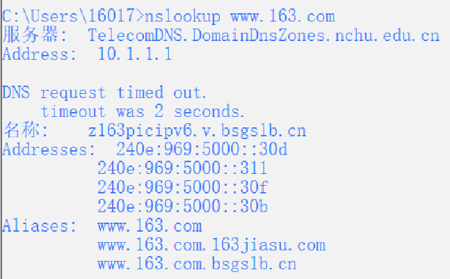
   
   

##### 常见的CDN绕过技术

①子域名查询（详细方式见上述“子域名查询”）

- 为什么要进行子域名查询？

  因为搭建CDN要花钱，所以管理员会对主站，访问量比较大的做cdn服务，但是不会对子站做cdn，这时候就可以通过查找子域名来查找网站的真实IP，一般情况下，子站跟主站在同一个C段内

- 子域名小技巧
  一般情况下，www.XXX.com和XXX.com指向的是同一个DNS服务器，进入XXX.com会自动跳转到www.XXX.com，所以XXX.com不需要大流量，不用做CDN。如果加www检测不出来，可以试着去掉，或许就可以得到真实IP了

②邮件服务查询

​		很多公司内部都会有一个邮箱服务器，这种邮箱服务器大部分是不会做CDN的。因为邮箱服务器一般都是公司内部人去访问，所以大部分不做CDN。因此，我们就可以根据对方邮件服务器给我们发送的邮件，来判断对方的IP地址

以墨者学院为例：

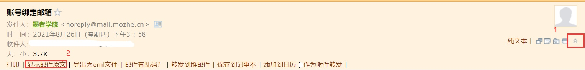

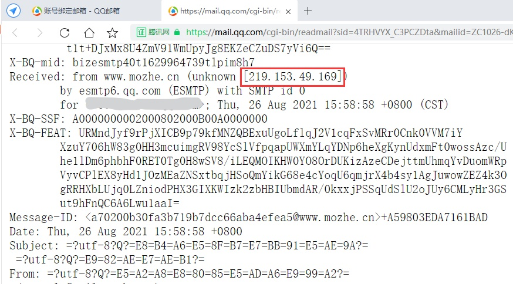

③国外地址查询

​		有些网站为了节省成本，不会把CDN部署在国外。假设现在你自己的网络公司有一个网站，但你的客户群体主要是在国内，因为国外用户不多，所以就不值得在国外搭建CDN，因此这样从国外访问国内的网站就很可能直接访问的就是主站的真实ip地址。

https://tools.ipip.net/cdn.php

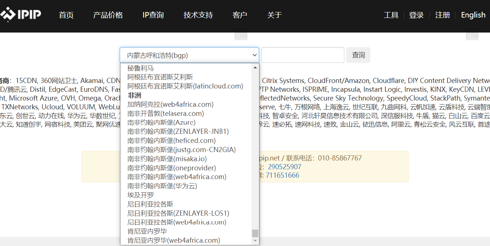

④黑暗引擎搜索特定文件

- google，shodan，zoomeye，fofa等（可参见“资产搜集”）
- 这里的特定文件，指的是站点的icon文件，也就是网站的图标，一般查看网页源代码可以找到，格式大致“http://www.xx.com/favicon.ico”。在shodan搜索网站icon图标的语法为：http.favicon.hash:hash值，hash是一个未知的随机数，我们可以通过shodan语法来查看一个已经被shodan收录的网站的hash值，来进一步获取到所有带有某icon的网站。

- 获取icon的hash值

  ```
  python工具
  #Python2 开发别搞错了执行环境
  #安装 mmh3 失败记得先安装下这个Microsoft Visual C++ 14.0
  import mmh3
  import requests
  response = requests.get('http://www.xx.com/favicon.ico')
  favicon = response.content.encode('base64')
  hash = mmh3.hash(favicon)
  print 'http.favicon.hash:'+str(hash)
  ```

- shodan的语法：http.favicon.hash:hash值

⑤遗留文件，扫描全网

- 一些站点在搭建之初，会用一些文件测试站点，例如“phpinfo()”文件，此类文件里就有可能包含了真实的IP地址。可以利用Google搜索引擎搜索关键字“site:xxx.com inurl:phpinfo.php”，搜索站点是否有遗留文件

- 扫描工具：fuckcdn，zmap等（由于目标网站可能过于庞大，采用工具扫描耗时过久，且对电脑读取性能要求较高，故不推荐采用此方式）


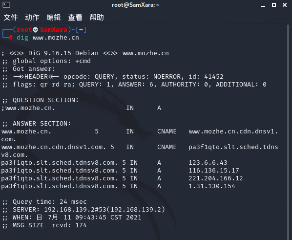

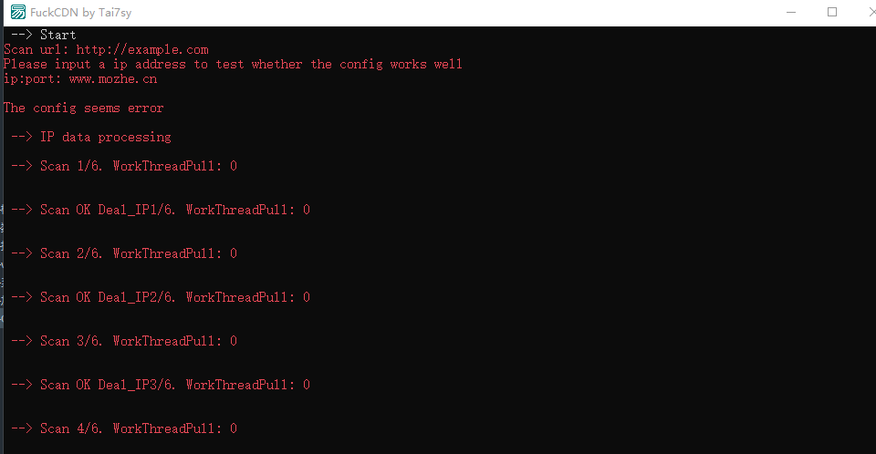

⑥DNS历史记录，以量打量（不推荐）

​	站点在使用CDN服务之前，它的真实IP地址可能被DNS服务器所记录到，此时我们就可以通过DNS历史记录找到目标真实IP。而“以量打量”就是常说的ddos攻击或者说是流量耗尽攻击，在网上开CDN的时候，都会分地区流量，就比如这个节点有100M流量，当这流量用完后，用户再访问就会访问网站真实的ip地址。（此方式需耗费极大的人力精力，就个人或小集体进行渗透测试时不推荐使用此方法）
情报社区：
https://x.threatbook.cnDNSdb
https://dnsdb.io/zh-cn/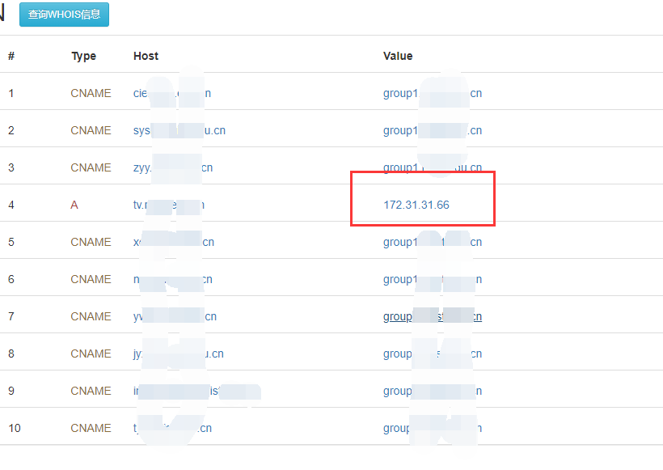

#### 网站信息

##### 备案信息查询

网站备案信息是根据国家法律法规规定，由网站所有者向国家有关部门申请的备案，是国家信息产业部对网站的一种管理途径，是为了防止在网上从事非法网站经营活动，当然主要是针对国内网站。

在备案查询中我们主要关注的是：单位信息例如名称、备案编号、网站负责人、法人、电子邮箱、联系电话等。

常用的备案信息查询网站有以下几个：

> ICP/IP地址/域名信息备案管理系统：http://beian.miit.gov.cn/publish/query/indexFirst.action
>
> ICP备案查询网：http://www.beianbeian.com/
>
> 备案吧吧：https://www.beian88.com/
>
> 天眼查：https://www.tianyancha.com/

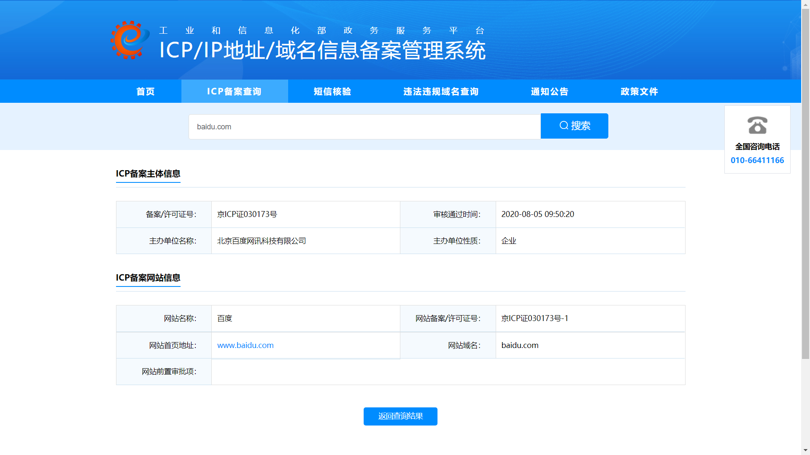

### 蜜罐探测

##### 蜜罐是啥？

蜜罐其实就相当于目标部署的一个陷阱，它伪装成一个正常的系统，静静地等待黑客前来入侵，进而监听黑客的攻击方式、操作动向、以及捕捉黑客画像

##### 蜜罐分类

①按交互方式分类，蜜罐可以分为三类：低交互式蜜罐，中交互式蜜罐，高交互式蜜罐

低交互蜜罐：通常是指与操作系统交互程度较低的蜜罐系统，仅开放一些简单的服务或端口，用来检测扫描和连接，这种容易被识别

中交互式蜜罐：介于低交互式和高交互式之间，能够模拟操作系统更多的服务，让攻击者看起来更像一个真实的业务，从而对它发动攻击，这样蜜罐就能获取到更多有价值的信息

高交互式蜜罐：指的是与操作系统交互很高的蜜罐，它会提供一个更真实的环境，这样更容易吸引入侵者，有利于掌握新的攻击手法和类型，但同样也会存在隐患，会对真实网络造成攻击

②按照不同用途可以分为：生产蜜罐和研究型蜜罐

生产蜜罐：易于使用，仅捕获有限的信息，主要由公司使用。生产蜜罐被组织放置在生产网络内与其他生产服务器一起，以改善其整体安全状态。通常生产蜜罐是低交互蜜罐，更易于部署。与研究蜜罐相比，它们提供的攻击或攻击者信息较少

研究型蜜罐：是为了收集有关针对不同网络的黑客社区的动机和策略的信息。这些蜜罐不会为特定组织增加直接价值; 相反，它们用于研究组织面临的威胁，并学习如何更好地防范这些威胁。研究蜜罐的部署和维护非常复杂，可以捕获大量信息，主要用于研究、军事或政府组织

③按实现方式，蜜罐可以分为：虚拟蜜罐和物理蜜罐

虚拟蜜罐：虚拟蜜罐通常是基于虚拟机技术模拟成的，虚拟蜜罐一般是中、低交互蜜罐，容易被识别，目前多数虚拟蜜罐都是基于Docker、 VMware Esxi或是KVM的

物理蜜罐：物理蜜罐通常是基于真实服务机器搭建的，其有自己的真实ip、自己的网络环境，但是成本相对较高

④按照是否收费，蜜罐可以分为：开源蜜罐和商业蜜罐

开源蜜罐：免费提供给社会、公开源代码，提供给大家学习的、研究的蜜罐

商业蜜罐：花钱、可定制、有专业公司和团队维护的蜜罐，不开源

##### 蜜罐观察与检测

**观察**

1.流量记录 观察burpsuite流量，出现许多api调用

2.网站响应速度
蜜罐经常会加载很多JS，会导致网页的响应速度变慢

3.网站JS
查看网站源码观察JS

4.端口
蜜罐往往开放了，很多端口；使用nmap对蜜罐进行端口扫描，进行判断

举例：使用nmap对一个ip进行扫描，同时开放了1433、3306、1521、那就有问题了...因为正常一个服务器不可能有3个数据库；同时开放了并识别了22 SSH服务、3389 RDP...这也是个问题

5.指纹
部分蜜罐会提供很多指纹信息，以此命中扫描

6.使用痕迹
举例：查看是否有系统所有者的使用文件，如密码文件、浏览器访问历史记录等，如果没有可能要注意一下了

7.系统限制
举例：查看系统命令执行状况如windows系统wmic、powershell是否执行；linux系统查看crontab、top等是否执行，原因就是部分蜜罐为了方便部署使用的镜像是最简系统

**检测**

浏览器插件

anti-honeypot  地址：https:*//github.com/cnrstar/anti-honeypot*

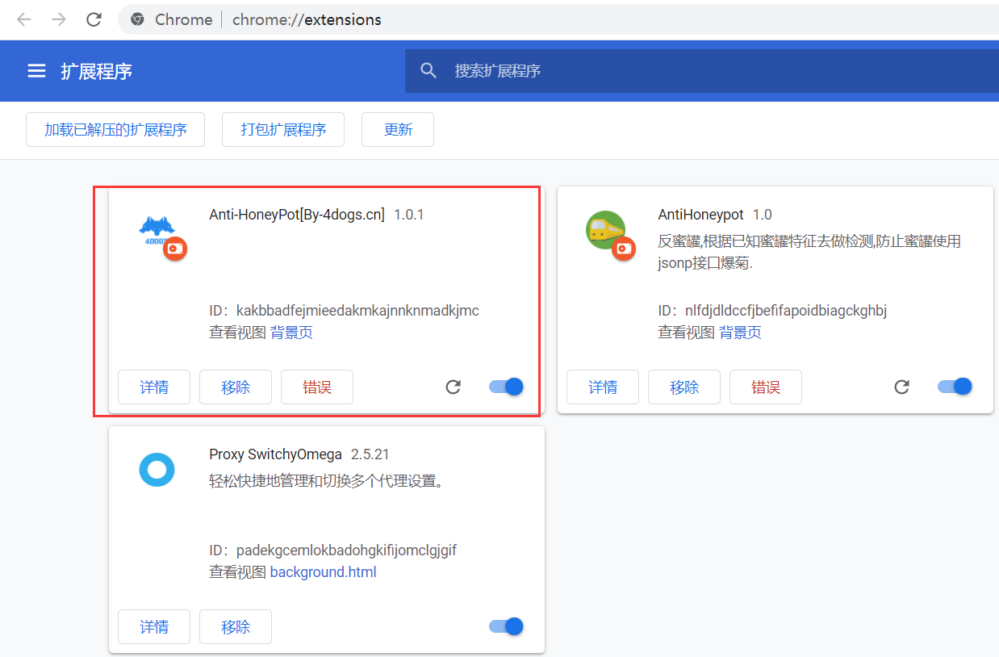


有提示是这样的

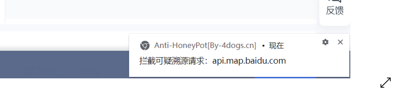

shodan检测

正常系统是绿色

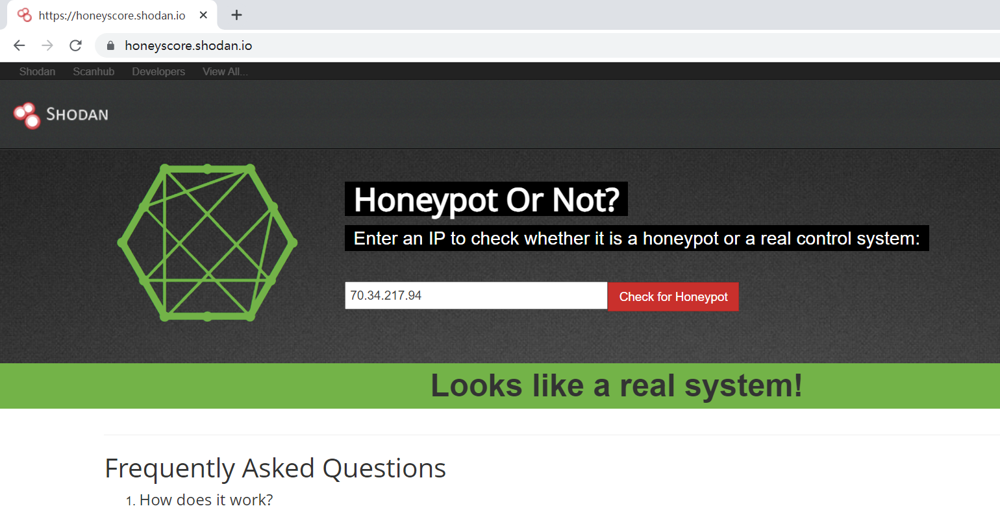

有蜜罐的如下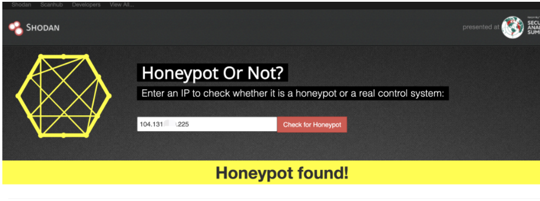


### 主机存活探测/端口扫描

#### 工具

推荐结合使用Masscan进行主机存活探测，Nmap进行端口扫描。

##### Masscan

​     Masscan与Zmap类似，同样采用了无状态的扫描技术。

- 允许自定义任意的地址范围和端口范围；
- 设置黑白名单；
- 设置扫描速率；
- 指定发包的源IP地址、源端口和源MAC地址进行伪装。
- 结果输出支持xml、binary、JSON、list等多种格式。
- 为了配合用户的各种扫描需求，Masscan提供了重试次数、UA字段值、发出数据包的TTL值、发包后的等待时间等扫描设置。
- Banner获取直接在扫描命令里使用—banners即可。

##### Zmap

Zmap采用了无状态的扫描技术，没有进行完整的TCP三次握手，因此扫描速度极大提升。Zmap的基本功能是扫描发现主机的开放端口。

- 一次扫描支持单端口，不支持在命令里设置目标IP。
- 设置黑白名单，由于Zmap设计为在全网范围内寻找主机，若想对特定网段进行扫描，可以利用白名单的方式；
- 设置扫描数量和扫描时间；
- 设置扫描速率，由于Zmap会以网络适配器支持的最快速率进行扫描，不会根据上游流量提供商自动调整发送速率，需要手动调整，来减少丢包和不正确的结果。可以通过设置每秒发包数量或带宽进行调整；
- 设置扫描源端口、源IP，伪造网关MAC地址进行伪装。
- 结果输出默认csv格式，经过额外的配置可输出redis和JSON；用户也可以用官方提供的API自己编写输出模块。
- 扫描模式，支持TCP SYN、ICMP echo、UDP三种扫描模式，用户也可以用官方提供的API自己编写探测模块。
- Banner获取，Zmap并不直接提供Banner获取功能，需要编写扩展模块，不过开发者已经为我们提供了一个样本。

##### Nmap

Nmap的功能非常强大，而且作为一个广泛使用的开源工具，全球的开发者都为其功能的丰富贡献了力量。

- 基本功能：主机发现，开放端口扫描，支持多端口、多网段，可对目标域名进行扫描；
- 识别功能：识别端口服务类型及版本、操作系统、设备类型等；
- 扫描模式：TCP SYN scan、TCP connect scan、UDP scan、No Ping scan等；
- 规避检测：分片、IP伪装、MAC伪装。

#### 工具安装教程

##### Masscan

**Windows下**

Masscan需要经过编译才能生成exe文件在Windows下使用。
***Masscan下载地址（使用命令可见官方文档）：***
https://github.com/robertdavidgraham/masscan/
编译工具：vs2012
编译选项中未添加vs2012的编译配置，所以直接编译会报错

解决方法：
在string_s.h中添加vs2012配置信息
位于misc-string_s.h,添加代码如下：

```
#if defined(_MSC_VER) && (_MSC_VER == 1700)
/*Visual Studio 2012*/
# include <stdio.h>
# include <string.h>
# define strcasecmp _stricmp
# define memcasecmp _memicmp
# ifndef PRIu64
# define PRIu64 "llu"
# define PRId64 "lld"
# define PRIx64 "llx"
# endif
```

编译成功，执行masscan.exe，提示Packet.dll: not found

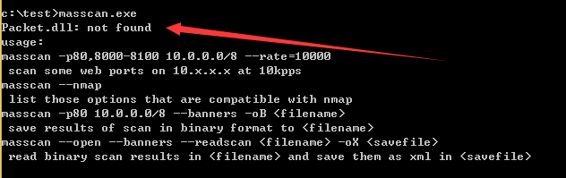

***Packet.dll获取方法：***
安装WinPcap后在System32下获得
***WinPcap下载地址：***
https://www.winpcap.org/install/default.htm
在另一系统安装WinPcap，在System32下找到Packet.dll和Wpcap.dll，复制到测试系统下masscan.exe的同级目录，再次运行
程序正常启动，但是无法扫描，报错如下：
FAIL: Error opening adapter: 系统找不到指定的设备。 (20) adapter[\Device\NPF_{71D19B82-0818-4685-A8E7-A6C7C812F2EA}].init: failed

**Linux下**

以下两种方式二选一即可

**编译安装**

```
apt-get install clang git gcc make libpcap-dev

git clone https://github.com/robertdavidgraham/masscan

cd masscan

make

cd ..

cp masscan/bin/masscan /bin
```

**apt安装**

```
apt install masscan
```

##### Zmap

***Zmap下载地址（使用命令可见官方文档）：***

https://github.com/zmap/zmap/

Linux下安装命令：

```
sudo apt install zmap
```

##### Nmap

***nmap下载地址（使用命令可见官方文档）：***

[https://nmap.org/download.html](https://nmap.org/download.html/)（若该网站访问较慢可选择下方网址）

http://www.nmap.com.cn/

官方网站同样提供了Zenmap，实现GUI界面交互完成端口扫描。

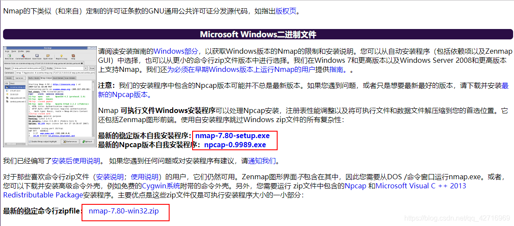

***安装之前最好验证以下安装包的完整性***

防止安装了被恶意篡改过或不完整的nmap。如果你不想要验证，也可以跳过该步骤，直接安装。
验证工具：[GNU Privacy Guard（GPG）](https://www.gnupg.org/)

***若下载的是Windows自安装程序，即：nmap-7.80-win32.zip。***

下载好之后，只需要解压，并在DOS窗口下运行nmap.exe;或者打开文件目录，双击nmap.exe也可以。
nmap也提供源代码编译，感兴趣的也可以自己进行编译。
注意：如果没有配置好环境变量，要在安装目录下运行程序。
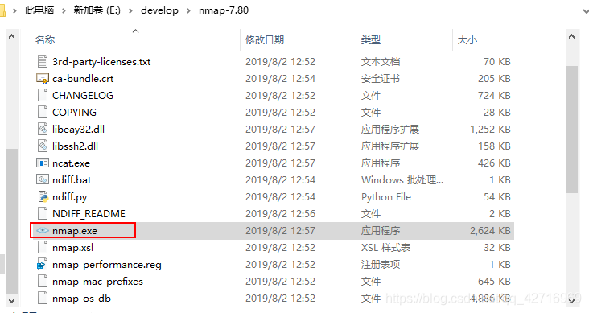

***之后就可以在命令行界面使用nmap了。***

如图：使用nmap -sP命令进行一个简单的主机发现扫描。

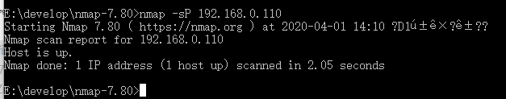

***环境变量的配置：***

配置好环境变量之后，我们就可以从任何目录执行命令，而不需要每次执行命令的时候都要进入nmap所在目录。
步骤：在搜索框中输入“系统”，打开系统的“高级系统设置”；

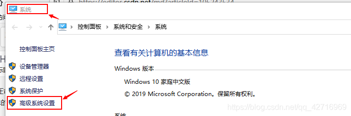

点击“环境变量”–>选择“系统变量”下的path，点击“新建”，复制nmap安装目录的路径粘贴在此处。不行的话重启电脑。

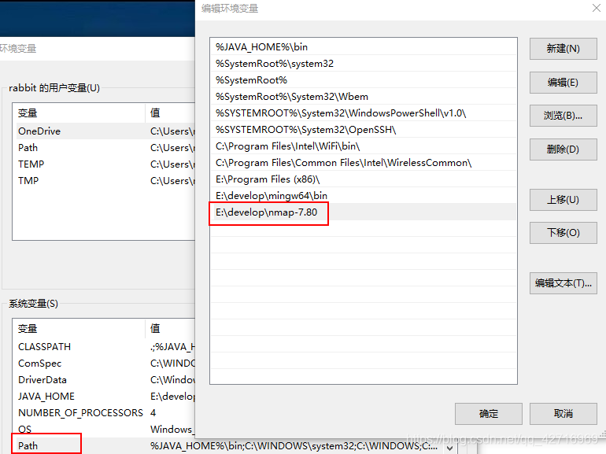

***Linux下***

Linux一般自带nmap工具，若要自行下载，选择linux版本的二进制包进行下载

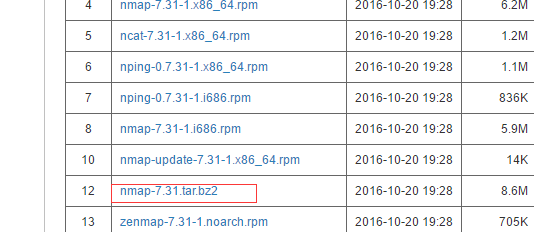

下载后先解压并进入源码目录：

```
tar -xjvf nmap-7.31.tar.bz2
cd nmap-7.31/
```

然后使用默认参数执行编译：

```
./configure
make
make install
```

等安装之后nmap命令就可以直接使用了，直接执行 nmap 会给出详细使用参数，执行 nmap -v 会输出当前版本号

nmap功能非常强大，可选项参数非常多，建议仔细阅读官方提供的文档。

### 信息泄露、敏感文件、敏感目录、后台目录、物理路径探测 

#### 信息泄露

信息泄漏很杂、就拿web安全来说

##### 目录遍历

目录浏览漏洞属于目录遍历漏洞的一种，目录浏览漏洞是由于网站存在配置缺陷，存在目录可浏览漏洞，这会导致网站很多隐私文件与目录泄露，比如数据库备份文件、配置文件等，攻击者利用该信息可以更容易得到网站权限，导致网站被黑。 风险：攻击者通过访问网站某一目录时，该目录没有默认首页文件或没有正确设置默认首页文件，将会把整个目录结构列出来，将网站结构完全暴露给攻击者； 攻击者可能通过浏览目录结构，访问到某些隐秘文件（如PHPINFO文件、服务器探针文件、网站管理员后台访问地址、数据库连接文件等）。

##### phpinfo()

PHPInfo函数信息泄露漏洞常发生一些默认的安装包，比如phpstudy等，默认安装完成后，没有及时删除这些提供环境测试的文件，比较常见的为phpinfo.php、1.php和test.php，虽然通过phpinfo获取的php环境以及变量等信息，但这些信息的泄露配合一些其它漏洞将有可能导致系统被渗透和提权。

phpinfo()函数返回的信息中包含了服务器的配置信息，包括：

1）PHP编译选项以及文件扩展名的相关信息；

2）php的版本信息

3）php的配置信息；

4）数据库信息；等敏感信息。这些敏感信息会帮助攻击者展开进一步的攻击。

##### 备份文件

备份文件泄露，在web服务中，尝尝不局限于网站的源代码泄露，网站的数据库备份文件，以及上传的敏感文件，或者一切正常备份，原则不允许访问的文件可被通过访问web路径进行下载得到，造成其信息泄露。有效的帮助攻击者理解网站应用逻辑， 为展开其他类型的攻击提供 有利信息，降低攻击的难度，可以进一步获取其他敏感数据。简单的来说：

网站备份文件泄露指管理员误将网站备份文件或是敏感信息文件存放在某个网站目录下。

外部黑客可通过暴力破解文件名等方法下载该备份文件，导致网站敏感信息泄露。

##### git泄漏

当前大量开发人员使用git进行版本控制，对站点自动部署。如果配置不当，可能会将.git文件夹直接部署到线上环境。这就引起了git泄露漏洞。


##### SVN

SVN（subversion）是程序员常用的源代码版本管理软件。一旦网站出现SVN漏洞，其危害远比SQL注入等其它常见网站漏洞更为致命，因为黑客获取到网站源代码后，一方面是掠夺了网站的技术知识资产，另一方面，黑客还可通过源代码分析其它安全漏洞，从而对网站服务器及用户数据造成持续威胁。更严重的问题在于，SVN产生的.svn目录下还包含了以.svn-base结尾的源代码文件副本（低版本SVN具体路径为text-base目录，高版本SVN为pristine目录），如果服务器没有对此类后缀做解析，黑客则可以直接获得文件源代码。

具体来说：

 1.在使用SVN管理本地代码过程中，会自动生成一个隐藏文件夹，其中包含重要的源代码信息。但一些网站管理员在发布代码时，不愿意使用‘导出’功能，而是直接复制代码文件夹到WEB服务器上，这就使隐藏文件夹被暴露于外网环境，这使得渗透工程师可以借助其中包含版本信息追踪的网站文件，逐步摸清站点结构。

 2.在服务器上布署代码时。如果是使用 svn checkout 功能来更新代码，而没有配置好目录访问权限，则会存在此漏洞。黑客利用此漏洞，可以下载整套网站的源代码。

3. .svn目录（隐藏目录）

    使用svn checkout后，项目目录下会生成隐藏的.svn文件夹（Linux上用ls命令看不到，要用ls -al命令）。 

    svn1.6及以前版本会在项目的每个文件夹下都生成一个.svn文件夹，里面包含了所有文件的备份，文件名为 .svn/text-base/文件名.svn-base。

    svn1.7及以后版本则只在项目根目录生成一个.svn文件夹，里面的pristine文件夹里包含了整个项目的所有文件备份。

##### HG泄漏

当开发人员使用 Mercurial 进行版本控制，对站点自动部署。如果配置不当,可能会将.hg 文件夹直接部署到线上环境。这就引起了 hg 泄露漏洞。

信息泄漏很多，这只是一小部分，有兴趣的同学可以多加学习，进行补充！

#### 敏感文件、敏感目录

##### 敏感文件目录探测

敏感文件、敏感目录挖掘一般都是靠工具、脚本来找

##### 常见敏感文件或目录

通常我们所说的敏感文件、敏感目录大概有以下几种：
后台
robots.txt
数据库log
sitemap.xml
mysql.sql
licence.txt
Git
hg/Mercurial
svn/Subversion
bzr/Bazaar
Cvs
WEB-INF泄露
备份文件泄露、配置文件泄露

##### 常用后台

admin/
admin.后缀
admin/login.后缀
manage
webmanager等

##### 工具扫描

需要专门的爆破字典。
常用的工具有：
（1）御剑
（2）爬虫（AWVS、Burpsuite等）
（3）搜索引擎（Google、Github等）
（4）wwwscan
（5）BBscan（一位巨佬写的python脚本：https://github.com/lijiejie/BBScan ）
（6）GSIL（也是一位巨佬写的python脚本：https://github.com/FeeiCN/GSIL ）
（7）社交平台

##### wfuzz

下载：
https://github.com/xmendez/wfuzz

##### dirseach

https://github.com/maurosoria/dirsearch

##### web 爬虫

利用burpsuite,awvs等软件爬行

##### 搜索引擎

site:xxx.xxx system
site:xxx.xxx 内部
site:xxx.xxx 系统
site:目标 admin
site:目标 login
site:目标 管理员登陆
site:目标 后台
site:目标 中心
site:目标 登录
site:目标 登陆
site:目标 管理中心
可以自行拓展

##### 文件路径

查看网站图片，其中目录很可能包含管理目录，这里查看要躲在几个地方查看
1.首页
2.新闻中心
3.上传点
就是查看的图片要有不同上传点上传的图片，如果图片保存路径在后台的下级目录，那么这种方法屡试不爽。

##### 查看源码

很多首页源码里就有定义后台路径，所以可以试试。

##### 源码审计

假设你知道了网站的CMS，可以指定CMS渗透，拿源码，审计后台

##### 漏洞利用

利用IIS短文件漏洞爆破猜解目录和文件名
SVN源码泄露漏洞
目录遍历，备份文件
可以插入任意图片URL的时候，可以利用referer钓后台
XSS或注入得到后台
XSS学问很多，提醒了你可以通过XSS就可以了
注入也可以配合XSS，前提是没有转移 支持修改，并且需要插在留言表或后台可以输出的地方。
SQL注入可以查看访问记录等。

##### 社会工程

社工的话，事在人为了。可以联系客服或管理员，骗取后台，理由可信 成功率没问题。
CMS判断出来后，可以下源码看他的后台在哪(前提未修改)，也可以百度此CMS后台。

##### 专门的技术支持目录

比如是 某一个 CMS，或者是某一个建站公司建的网站
有些网站底部，会有网站技术支持等信息，寻找尝试是否有专门的技术支持后台

##### 旁站C段子域名

可能不在主站上，后台有可能在旁站C段子域名上。

#### 后台目录

什么是后台？

　　后台指的是网站管理后台 用于管理网站数据内容  比如增加用户权限 管理用户登陆 删除用户等

常用后台

一般默认与常用后台

　　/admin/

　　/login/

　　/system/

　　/manage/

　　/guanli

注意: 一般后台目录后面还会跟文件名
如 /admin/login.php

 　/admin/admin_login.php

　/admin/adminlogin.php

robots.txt 

Robots 是搜索引擎对爬虫的规定 允许爬虫爬哪个目录 不允许爬虫爬哪个目录 违权究责 

Robots 一般存在于网站根目录
　　注意 : 不是所有网站都有       一般小网站没有
　　　　disallow 禁止被爬行 可能存在后台目录


通过搜索引擎

Google hack 语法  

　　如 site:xxx.com 后台

　　　　可能可搜到 

　　site:指定目标域名 后面可接    管理|后台管理|管理员|系统

网页底部

　　网页底部可能存在网站管理 点击即可进入后台

#### 物理路径探测

##### 报错

**报错获得**
在处理报错信息的问题上如果处理不当，就可导致路径信息泄露，比如访问一些不存在的文件等思路。
这里的报错方法就很多了，说不完的，具体还要根据实际情况操作。下面说几种实用的↓•1.有动态URL的地方可以替换参数 替换参数值为不存在的，很多时候都能爆物理路径
•2.访问不存在的文件名 文件 或者改正常后缀为不支持的后缀。 IIS7.0以上，如果没有修改404页面，只要浏览web任意不存在的文件，都会直接暴出绝对路径。同理，thinkphp也有这个性质。
在id=1的注入点，使用各种不支持的字符，比如id=1’ id=? id=-1 id=\ id=/ 都有可能暴出绝对路径。
还有的时候传一些错误图片会报错 windows不支持的符号，?:<>之类的，还有windows不支持的文件名aux Windows服务器上传aux文件或者新建aux文件夹，因为不允许这种文件存在而报错泄露绝对路径。
•3.尤其是php框架写的站，上传很容易爆出物理路径，根据具体情况了，比如一次提交允许的后缀，整体提交时抓包改为不支持的后缀，放包，很多时候都能爆出物理路径。
有一部分都是sql语句报错，sql很多时候会爆物理路径，所以相信你已经会拓展了。

##### 后台

**后台获得**
可以登录后台的话，后台首页一般都有服务器信息的，大部分情况下物理路径都在里面。

#### 功能点

**上传图片处**
第一点：在上传图片处，这里我说下最可能存在问题的点，就是关于上传相关证明，进行实名制上传信息等功能页面，在上传图片时进行抓包，然后查看返回包，那么就可看到当前服务器的绝对路径信息。

##### 搜索引擎

**搜索引擎探测**
结合关键字和site语法搜索出错页面的网页快照，常见关键字有warning和fatal error。
注意，如果目标站点是二级域名，site接的是其对应的顶级域名，这样得到的信息要多得多。
Site:[http://xxx.edu.tw](https://link.zhihu.com/?target=http%3A//xxx.edu.tw) warning
Site:[http://xxx.com.tw](https://link.zhihu.com/?target=http%3A//xxx.com.tw) “fatal error”
由于很多网站本身容错做的不好，会有一些暴露物理路径的界面，如果被搜索引擎收录了，那么可以通过搜索引擎来找到
在搜索引擎搜索 site:目标 关键字
我总结了一下常见的报错关键词↓
warning
error
module file not exist
数据库
配置出错
找不到包含文件
包含路径
路径为
select Warning: mysqli_query() expects parameter to be mysqli boolean given in on line directory in Fatal error require_once() Failed opening required include_path=

##### 容器特性

容器特性爆物理路径
很多，如：Apache Tomcat、Struts2、CMS、zabix、Nginx等等，例如Nginx的某版本解析漏洞，就可造成路径信息泄露。
•IIS大于6的版本，基本都是 导致他404就可以爆出物理路径、IIS名、IIS版本。这个很简单，随便访问个不存在的目录或文件就可以。
•nginx文件类型错误解析爆路径: 说明：要求Web服务器是nginx，且存在文件类型解析漏洞。有时在图片地址后加/x.php，该图片不但会被当作php文件执行，有可能爆出物理路径 
•/etc/httpd/conf/httpd.conf
这是apache默认目录，最底下有一句
Load config files in the "/etc/httpd/conf.d" directory, if any. IncludeOptional conf.d/.conf
这代表，在/etc/httpd/conf.d目录下的所有.conf文件都会被加载，也就是说管理员可以在/etc/httpd/conf.d/.conf里面写网站目录。
所以最后读 /etc/httpd/conf.d/vhost.conf
成功读出网站绝对路径就是先读 /etc/httpd/conf/httpd.conf
没有网站目录就看IncludeOptional conf.d/*.conf 看完就尝试读 /etc/httpd/conf.d/httpd.conf
/etc/httpd/conf.d/vhost.conf
/etc/httpd/conf.d/httpd-vhost.conf
/etc/httpd/conf.d/httpd.conf.bak 等等

##### 文件泄露

遗留文件 探针文件
通过遗留文件获得，比如 phpinfo.php info.php site.php 1.php a.php 一些探针文件啊都有，等等。在遗留文件中搜索 SCRIPT_FILENAME。
很多网站的根目录下都存在测试文件，脚本代码通常都是phpinfo()，
如：test.php ceshi.php info.php phpinfo.php php_info.php 1.php

**phpmyadmin爆路径**
一旦找到phpmyadmin的管理页面，再访问该目录下的某些特定文件，就很有可能爆出物理路径。
至于phpmyadmin的地址可以用wwwscan这类的工具去扫，也可以选择google。
/phpmyadmin/libraries/lect_lang.lib.php /phpMyAdmin/index.php?lang[]=1 /phpMyAdmin/phpinfo.php load_file() /phpmyadmin/themes/darkblue_orange/layout.inc.php /phpmyadmin/libraries/select_lang.lib.php /phpmyadmin/libraries/lect_lang.lib.php /phpmyadmin/libraries/mcrypt.lib.php
**XML处** 第一点：一些XML限制或删除不完全，可导致服务器等信息泄露。

**配置文件找路径**
•如果注入点有文件读取权限，就可以手工load_file或工具读取配置文件，再从中寻找路径信息（一般在文件末尾）。各平台下Web服务器和PHP的配置文件默认路径可以上网查，这里列举常见的几个。
Windows: c:\windows\php.ini php配置文件 c:\windows\system32\inetsrv\MetaBase.xml IIS虚拟主机配置文件

•如果有root读取文件的权限，或者任意文件读取漏洞，可以读取容器的配置文件，或者集成环境的固定web目录，判断集成环境，可以通过mysql的根目录判断，前面注入时说到的@@datadir: 常见配置文件: C:\Windows\system32\inetsrv\metabase.xml C:\Windows\System32\inetsrv\config\applicationHost.config C:\xampp\apache\conf\httpd.conf /var/www/conf/httpd.conf
常见集成环境默认目录，后面往往还有以域名命名的目录，
比如: C:\www\baidu
C:\Inetpub\wwwroot
C:\xampp\htdocs
D: \phpStudy\WWW/home/wwwroot/ /www/users/

##### 默认路径

Linux
/var/www/html/网站名
/etc/php.ini php配置文件
/etc/httpd/conf.d/php.conf
/etc/httpd/conf/httpd.conf Apache配置文件
/usr/local/apache/conf/httpd.conf
/usr/local/apache2/conf/httpd.conf
/usr/local/apache/conf/extra/httpd-vhosts.conf 虚拟目录配置文件