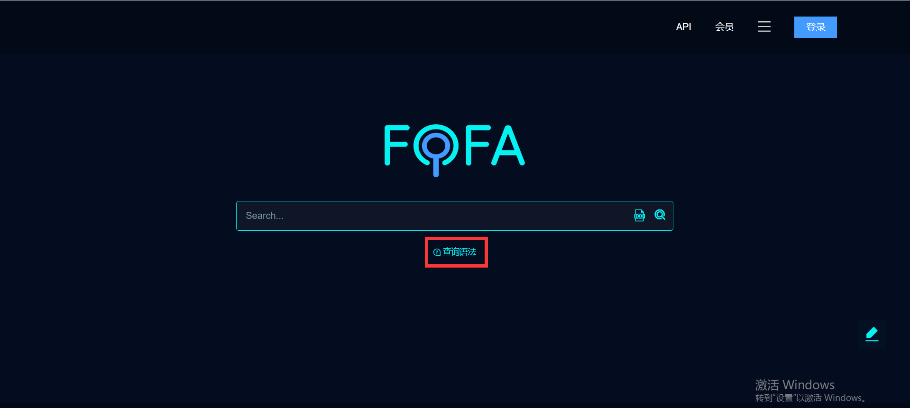
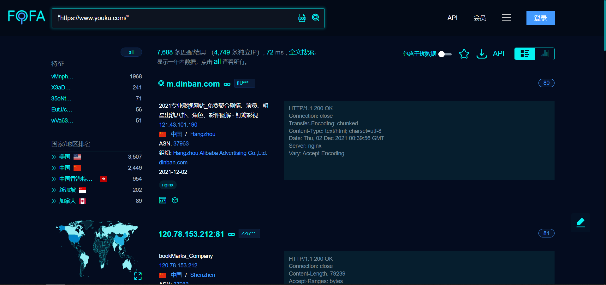
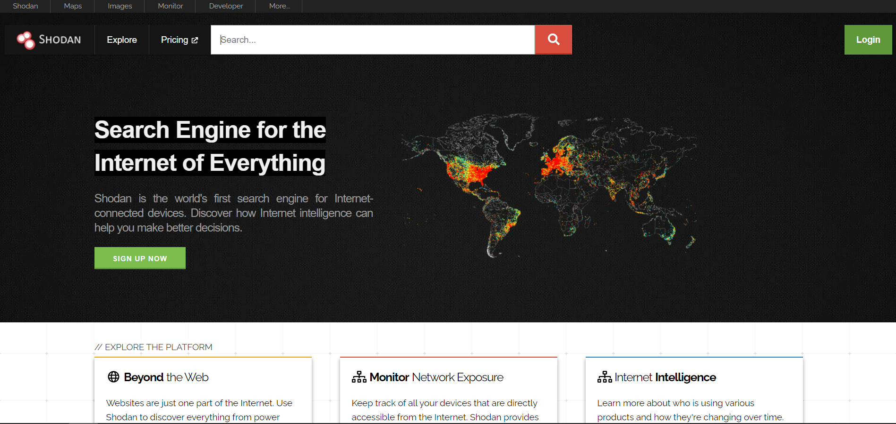
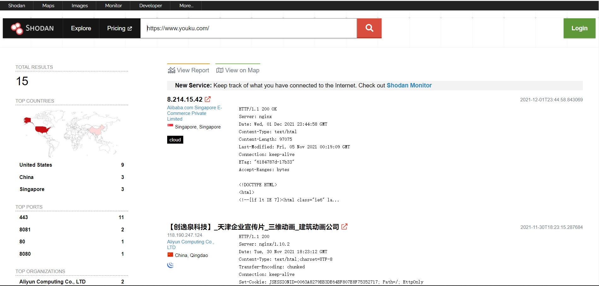
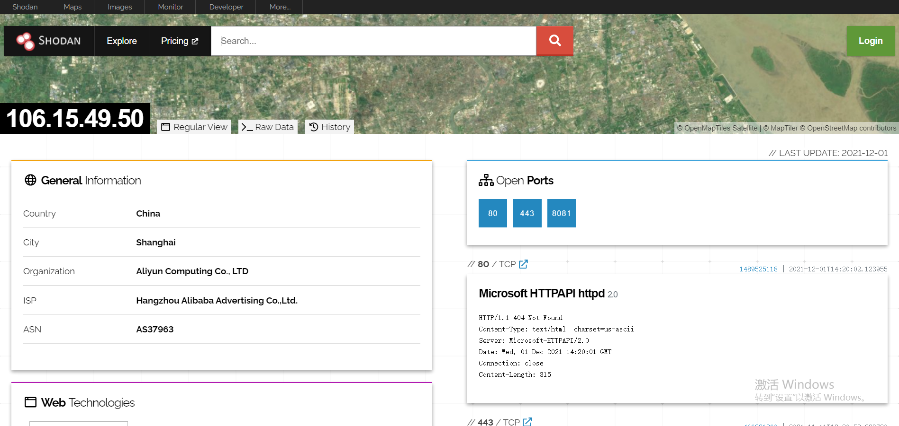
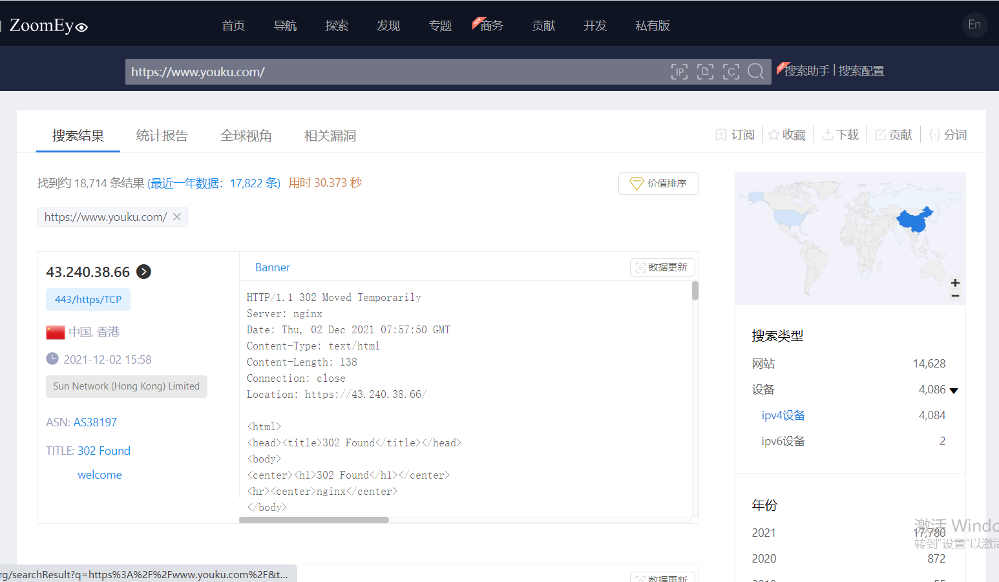

# 信息收集
### 资产收集
给我们的是一个公司或者组织的名字，让我们以这个公司为目标做红蓝对抗。
#### fofa/shodan/zoomeye的使用

##### https://fofa.so/

FOFA 搜索引擎检索到的内容主要是服务器，数据库，某个网站管理后台，路由器，交换机，公共ip的打印机，网络摄像头，门禁系统，Web服务等等。 这类搜索引擎又有另一个名字：网络空间测绘系统。

例如Apache出来了一个高危漏洞，受影响的版本号为2.4.23,我们需要去本公司可能受此漏洞影响的Apache服务器，那么我们可以使用高级查询语句server==”Apache/2.4.23”&&domain=”xxx.com”，搜索结果即为本公司域名下的所有子域名可能存在Apache2.4.23版本漏洞的URL，安全人员可以对结果进行检查，及时修复漏洞。（详细语法可在网页搜索框下方点击“查询语法”）

特点

1.支持API查询接口，便于进行程序间的自动化查询、处理功能，进行进一步的业务分析。

​	用法：所有调用都需要提供身份信息，主要是email和key，email主要是注册和登陆时填写的email，key需要用户到个人中心获取32位的hash值，即为API KEY。将上面的两个信息填入api接口中，即可获取json格式的数据。

2.支持下载功能

​	用法：搜索到结果之后可在右侧选择下载功能，可下载搜索到的所有数据，下载的格式支持CSV，JSON，XML格式，方便程序调用进行全网扫描。

注意

1) 普通会员和高级会员的 免费100条 和 免费10000条 是指每天调用API可以免费获取前100条和前10000条,假设高级会员调用API,每页获取3333条，第1、2、3页由于没有超过前10000条，所以免费，第4页超过前10000条，所以会扣除1FOFA币。
2) 直接下载数据，无论多少条数据，都要花费FOFA币。
   普通会员300 高级会员1000 终身制 。

##### https://www.shodan.io/

**Shodan是用于搜索连接到互联网的设备的工具。**

与搜索引擎可以帮助你找到网站不同，Shodan可以帮助你找到有关台式机,服务器，loT设备等的信息。此信息包括元数据，例如在每个设备上运行的软件。
Shodan的常见用途包括网络安全，市场研究，网络风险，扫描loT设备和跟踪勒索软件。

连接shodan的方法有很多，比如网站、官方的python命令行界面工具和库，各种语言的社区驱动库以及官方的REST API与Shodan，此处主要介绍网站。

它的工作方式类似于CLI工具的搜索命令，但带有精美的WebUI来显示结果。它显示每个主机的摘要，与查询匹配的主机总数(如CLI的count命令）和一些统计信息(如stats命令)。

选择主机后，可以看到快照规范表，漏洞影响主机，开放端口和开放端口标识信息（如下）。

##### https://www.zoomeye.org/（推荐）

**ZoomEye是一款针对网络空间的搜索引擎，收录了互联网空间中的设备、网站及其使用的服务或组件等信息。**

**ZoomEye** 拥有两大探测引擎：**Xmap** 和 **Wmap**，分别针对网络空间中的设备及网站，通过 24 小时不间断的探测、识别，标识出互联网设备及网站所使用的服务及组件。研究人员可以通过 ZoomEye 方便的了解组件的普及率及漏洞的危害范围等信息。

虽然被称为 “黑客友好” 的搜索引擎，但ZoomEye 并不会主动对网络设备、网站发起攻击，收录的数据也仅用于安全研究。ZoomEye更像是互联网空间的一张航海图。ZoomEye兼具信息收集的功能与漏洞信息库的资源，对于广大的渗透测试爱好者来说以一件非常不错的利器。

zoomeye所收集的信息比较全，不仅提供网站ip，端口使用设备，地区分布等等，甚至还会给出各大组件、服务器系统等存在的历史性漏洞的描述文档，如果使用漏洞的描述性文档中所给出的指示性内容，那么就可以找寻目标进行攻击了！

##### 使用手册

针对不同的信息需要，搜索时会有对应的查询语句

fofa：网站自带查询语句（搜索框下方）

shodan：https://www.jianshu.com/p/0c184915c118

zoomeye:https://blog.csdn.net/ncafei/article/details/63683377

#### 搜索引擎

##### google hack

google hack是指使用[Google](https://baike.baidu.com/item/Google)等搜索引擎对某些特定的网络主机漏洞（通常是服务器上的脚本漏洞）进行搜索，以达到快速找到漏洞主机或特定主机的漏洞的目的。

###### 介绍

Google毫无疑问是当 今世界上最强大的搜索引擎。然而，在黑客手中，它也是一个秘密武器，它能搜索到一些你意想不到的信息。赛迪编者把 他们进行了简单的总结不是希望您利用他去攻击别人的网站，而是利用这些技巧去在浩如烟海的网络信息中，来个大海捞针，寻找到对您有用的信息。

在SEO优化中,通常使用这种技术达到入侵一些网站挂外链之用。[黑帽SEO](https://baike.baidu.com/item/黑帽SEO/6111825)手法用来做[google优化](https://baike.baidu.com/item/google优化/8285781)推广和百度优化推广，应用得当，效果是十分明显的。 SEO俗语：不管白猫黑猫，抓到耗子就是好猫。

###### 基本命令

### googlehack 常用语法

site    指定域名

intext  正文中存在关键字的网页

intitle  标题中存在关键字的网页

info    一些基本信息

inurl   URL存在关键字的网页

filetype 搜索指定文件类型

site:xx.com 返回所有与该站有关的url

link:xx.com 返回所有与该站做了链接的站

site:xx.com filetype:txt 查找TXT文件 其他的以此类推

查找后台

site:xx.com intext:管理

site:xx.com inurl:login

site:xx.com intitle:后台

查看服务器使用的程序

site:xx.com filetype:asp

site:xx.com filetype:php

site:xx.com filetype:jsp

site:xx.com filetype:aspx

查看上传漏洞

site:xx.com inurl:file

site:xx.com inurl:load

查找注射点

site:xx.com filetype:asp

##### github搜索语法
### 域名/ip/网站信息
### 蜜罐探测
### 主机存活探测/端口扫描
### 信息泄露、敏感文件、敏感目录、后台目录、物理路径探测 